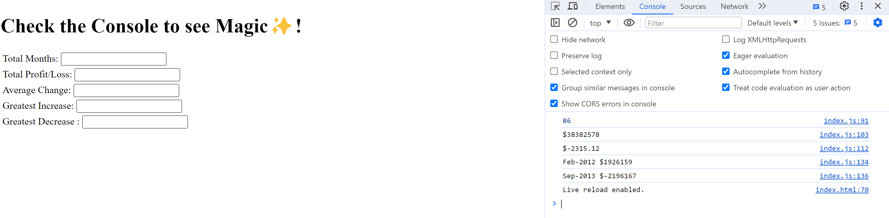

# Console-Finances
JavaScript Challenge:  Console Finances  
Overview 
In this challenge, you'll be using the concepts you've learned to complete the required activity.
This activity presents a real-world situation in which your newfound JavaScript skills will come in
handy. You are tasked with creating code for analyzing the financial records of a company. You
have been provided with a financial dataset in the starter/index.js file.

1. Create a new GitHub repo called Console-Finances . Then, clone it to your computer.
2. Copy the starter files in your local git repository.
You have been given a dataset composed of arrays with two fields, Date and Profit/Losses.
Your task is to write JavaScript code that analyzes the records to calculate each of the following:
The total number of months included in the dataset.
The net total amount of Profit/Losses over the entire period.
The average of the changes in Profit/Losses over the entire period.
You will need to track what the total change in Profit/Losses are from month to month
and then find the average.
( Total/(Number of months - 1) )
The greatest increase in Profit/Losses (date and difference in the amounts) over the entire
period.
The greatest decrease in Profit/Losses (date and difference in the amounts) over the entire
period.

Screenshot of deployed page

Link to deployed page
https://estellefruity.github.io/Console-Finances/